<picture>
  <source media="(prefers-color-scheme: dark)" srcset="./assets/banner-dark.svg">
  <source media="(prefers-color-scheme: light)" srcset="./assets/banner-light.svg">
  
</picture>

Ich baue Websites, Web-Apps und Werkzeuge — und zusammen mit
[@CremerFreddy](https://github.com/CremerFreddy) das Softwarestudio
**[Talvesa](https://github.com/Talvesa-eGbR)** in Freiburg im Breisgau.

```python
class Me:
    base     = "Freiburg im Breisgau"
    studio   = "Talvesa"                       # talvesa.de
    stack    = ["Python", "Django", "React", "PostgreSQL", "Docker"]
    focus    = [
        "Websites, die schnell laden und für alle bedienbar sind",
        "Web-Apps und Werkzeuge, die sich nach echten Abläufen richten",
        "APIs, Automatisierung und saubere Deploys",
        "mit Claude als Teil des Teams",
    ]
    rules    = [
        "Nichts wird zweimal getippt.",
        "Eine Schutzmaßnahme existiert erst, wenn ein Test ihre Wirkung prüft.",
        "Barrierefreiheit wird gemessen, nicht behauptet.",
    ]
```

<br>

<p>
  <a href="https://talvesa.de"></a>
  <a href="https://github.com/Talvesa-eGbR"></a>
</p>
