<picture>
  <source media="(prefers-color-scheme: dark)" srcset="./assets/hero-dark.svg">
  <source media="(prefers-color-scheme: light)" srcset="./assets/hero-light.svg">
  
</picture>

 

  Websites, Web-Apps und Apps — von der ersten Skizze bis live. 
  Gebaut in Freiburg, bei <a href="https://talvesa.de"><b>Talvesa</b></a>.

 

<picture>
  <source media="(prefers-color-scheme: dark)" srcset="./assets/parts-dark.svg">
  <source media="(prefers-color-scheme: light)" srcset="./assets/parts-light.svg">
  
</picture>
